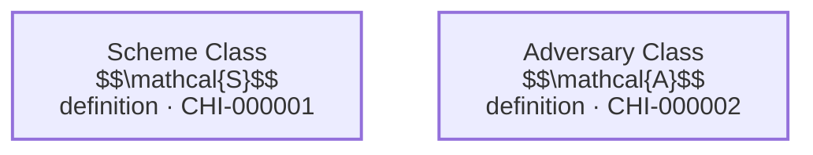

# Article 1 Foundation Graph

```mermaid
---
config:
  htmlLabels: false
  markdownAutoWrap: false
---
flowchart TD
    CHI_000001["`Scheme Class

$$\mathcal{S}$$

definition · CHI-000001`"]
    CHI_000002["`Adversary Class

$$\mathcal{A}$$

definition · CHI-000002`"]

    classDef definition stroke-width:2px;
    classDef assumption stroke-dasharray:5 5;
    classDef lemma stroke-width:3px;
    classDef theorem stroke-width:4px;
    class CHI_000001 definition;
    class CHI_000002 definition;
```
