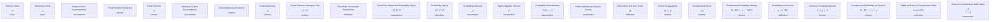

# Mathematical Registry

```mermaid
flowchart TD
    CHI_000001["<div><div>Scheme Class</div><div style='margin:14px 0'>$$\mathcal{S}$$</div><div>class</div></div>"]
    CHI_000002["<div><div>Adversary Class</div><div style='margin:14px 0'>$$\mathcal{A}$$</div><div>class</div></div>"]
    CHI_000003["<div><div>Scheme Class Nonemptiness</div><div style='margin-top:12px'>assumption</div></div>"]
    CHI_000004["<div><div>Fixed Scheme Existence</div><div style='margin-top:12px'>lemma</div></div>"]
    CHI_000005["<div><div>Fixed Scheme</div><div style='margin:14px 0'>$$\mathcal{S}$$</div><div>lemma</div></div>"]
    CHI_000006["<div><div>Adversary Class Nonemptiness</div><div style='margin-top:12px'>assumption</div></div>"]
    CHI_000007["<div><div>Fixed Adversary Existence</div><div style='margin-top:12px'>lemma</div></div>"]
    CHI_000008["<div><div>Fixed Adversary</div><div style='margin:14px 0'>$$\mathcal{A}$$</div><div>lemma</div></div>"]
    CHI_000009["<div><div>Fixed Scheme-Adversary Pair</div><div style='margin:14px 0'>$$(\mathcal{S},\mathcal{A})$$</div><div>lemma</div></div>"]
    CHI_000010["<div><div>Fixed Pair Adversarial Experiment</div><div style='margin-top:12px'>definition</div></div>"]
    CHI_000011["<div><div>Fixed Pair Adversarial Probability Space</div><div style='margin:14px 0'>$$(\Omega,\mathcal{F},P)$$</div><div>assumption</div></div>"]
    CHI_000012["<div><div>Probability Space</div><div style='margin:14px 0'>$$(\Omega,\mathcal{F},P)$$</div><div>definition</div></div>"]
    CHI_000013["<div><div>Probability Measure</div><div style='margin:14px 0'>$$P$$</div><div>assumption</div></div>"]
    CHI_000014["<div><div>Sigma-Algebra Closure</div><div style='margin:14px 0'>$$\mathcal{F}$$</div><div>assumption</div></div>"]
    CHI_000015["<div><div>Probability Normalization</div><div style='margin:14px 0'>$$P(\Omega)=1$$</div><div>assumption</div></div>"]
    CHI_000016["<div><div>Finite Additivity for Disjoint Events</div><div style='margin-top:12px'>assumption</div></div>"]
    CHI_000017["<div><div>Adversarial Success Event</div><div style='margin:14px 0'>$$W$$</div><div>definition</div></div>"]
    CHI_000018["<div><div>Event Measurability</div><div style='margin:14px 0'>$$W\in\mathcal{F}$$</div><div>lemma</div></div>"]
    CHI_000019["<div><div>Complement Event</div><div style='margin:14px 0'>$$\neg W$$</div><div>lemma</div></div>"]
    CHI_000020["<div><div>Complement Probability Identity</div><div style='margin:14px 0'>$$P(\neg W)=1-P(W)$$</div><div>lemma</div></div>"]
    CHI_000021["<div><div>Probability of Success</div><div style='margin:14px 0'>$$q=P(W)$$</div><div>definition</div></div>"]
    CHI_000022["<div><div>Success Probability Bounds</div><div style='margin:14px 0'>$$0\leq q\leq1$$</div><div>lemma</div></div>"]
    CHI_000023["<div><div>Complement Probability of Success</div><div style='margin:14px 0'>$$P(\neg W)=1-q$$</div><div>lemma</div></div>"]
    CHI_000024["<div><div>Odds as Event-to-Complement Ratio</div><div style='margin:14px 0'>$$\operatorname{Odds}(W)$$</div><div>definition</div></div>"]
    CHI_000025["<div><div>Event-to-Complement Odds Ratio</div><div style='margin:14px 0'>$$\frac{q}{1-q}$$</div><div>proposition</div></div>"]
```
