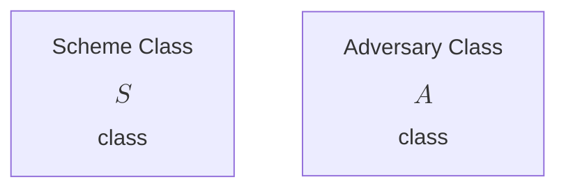

# Mathematical Registry

```mermaid
flowchart TD
    CHI_000001["<div><div>Scheme Class</div><div style='margin:14px 0'>$$\mathcal{S}$$</div><div>class</div></div>"]
    CHI_000002["<div><div>Adversary Class</div><div style='margin:14px 0'>$$\mathcal{A}$$</div><div>class</div></div>"]
```
